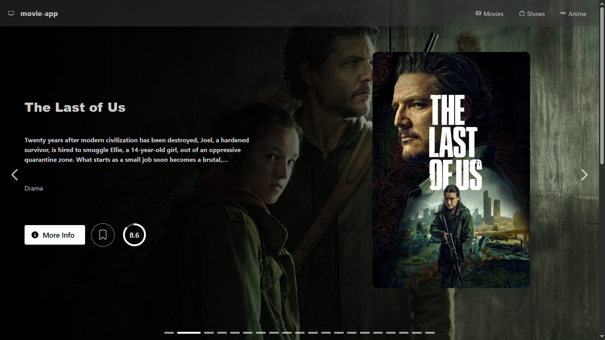
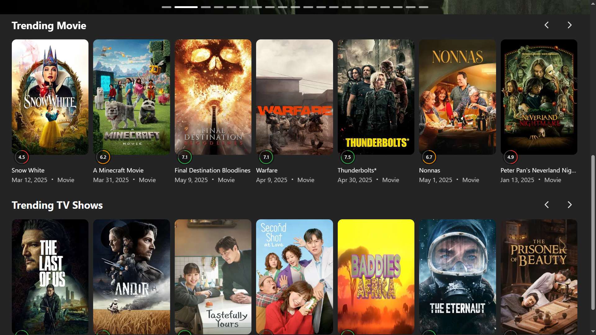
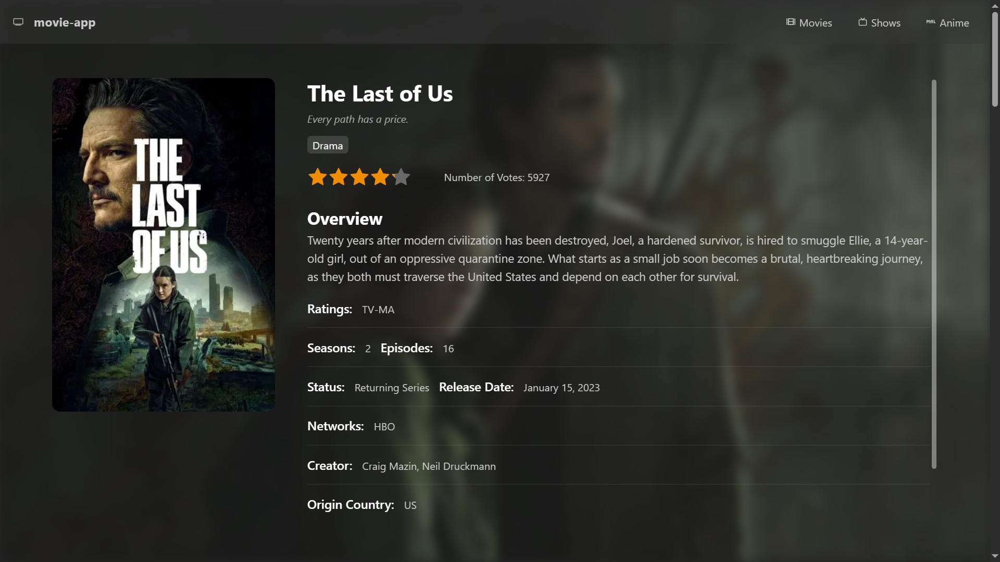
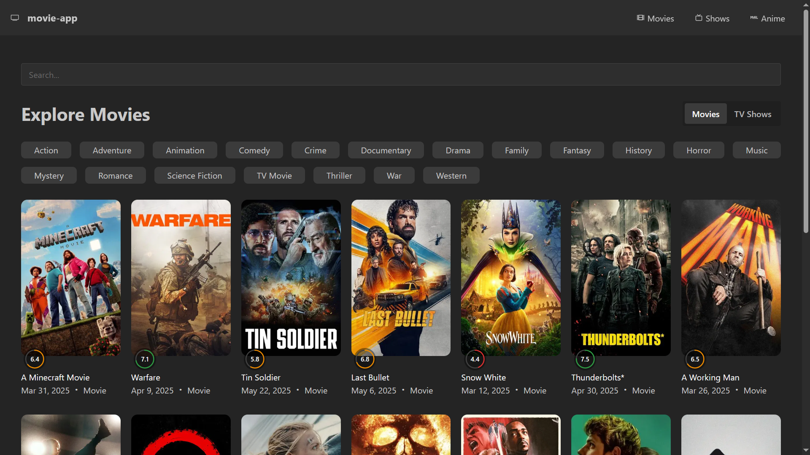

<h1 align="center">🎬 Movie App</h1>
<br>

> A movie and TV discovery app built with [React](https://react.dev/), using [The Movie Database](https://www.themoviedb.org) and [Mantine UI](https://mantine.dev/).

Live Demo: [c4523-movie-app.vercel.app](https://c4523-movie-app.vercel.app)

## 📁 Screenshots






## 🛠️ Setup

```bash
# Clone the project to your machine
git clone https://github.com/Chai4523/movie-app.git
cd movie-app

# This project uses pnpm as package manager, install if you dont have it
npm install -g pnpm

# Install dependencies
pnpm install

# Run the development server
pnpm run dev
```

## 📅 Coming Soon

These features are in development to enhance the discovery experience:

- 📱💻🖥️ Responsive View
- 📺 Anime Search & Discovery powered by Jikan API
- ❤️ Save favorites

Stay tuned!

## 🤝 Acknowledgements


This project uses the TMDB API but is not endorsed or certified by TMDB.
